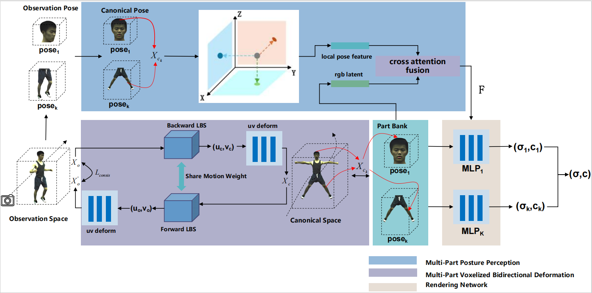

# 项目名称

PB-NeRF: Part-Based Neural Radiance Fields for Human Rendering  

## 简介

> PB-NeRF is a framework for part-based human reconstruction using Neural Radiance Fields, enabling high-fidelity novel view synthesis and accurate part-based deformation modeling.

## 方法

