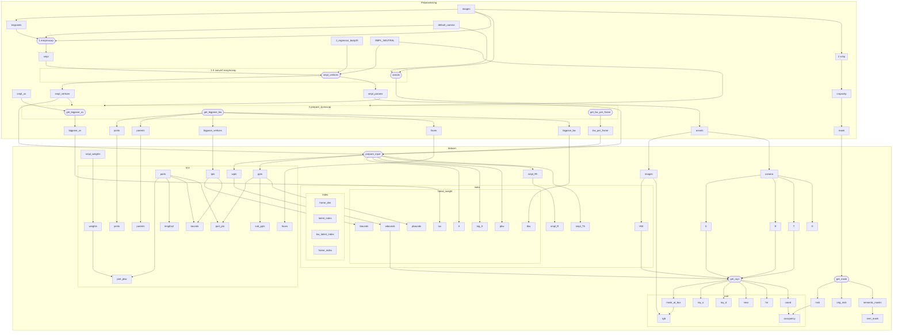

# Fast Reconstruction of Dynamic Human Body from Monocular Video
## Data stream


## 环境配置
### [pb-nerf](https://zju3dv.github.io/instant_nvr/)
```shell
conda create -n pb-nerf python=3.9
conda activate pb-nerf
conda install pytorch==1.13.0 torchvision==0.14.0 torchaudio==0.13.0 pytorch-cuda=11.7 -c pytorch -c nvidia
conda install -c fvcore -c iopath -c conda-forge fvcore iopath
conda install -c bottler nvidiacub
conda install pytorch3d=0.7.2 -c pytorch3d

cd pb-nerf
pip install -r requirements.txt
```


### [easymocap](https://chingswy.github.io/easymocap-public-doc/install/install.html#20230630-update)
书接上文 python 3.9, torch 1.13.0, cuda 11.7 的环境  
更新最新的 `setuptools`
```bash
pip install -U setuptools
```

```bash
git clone https://github.com/zju3dv/EasyMocap.git
pip install -r requirements.txt
pip install pyrender
python setup.py develop
```


### [schp](https://chingswy.github.io/easymocap-public-doc/install/install_segment.html#schp-self-correction-for-human-parsing)
```bash
git clone https://github.com/facebookresearch/detectron2.git
cd detectron2
rm -r build/ **/*.so
cd ..
pip install -e detectron2
```

```bash
cd EasyMocap/3rdparty
git clone https://github.com/chingswy/Self-Correction-Human-Parsing.git
```


### 杂项
```bash
sudo apt-get install libboost-dev
git clone https://github.com/MPI-IS/mesh.git
pip install --upgrade pip==22.3.1 # 回滚 pip 到 22.3.1
cd mesh
vim requirements.txt # 删除 requirements.txt 中 pyopengl, numpy
make all 
pip install numpy==1.23 # smpl 需要 chumpy, chumpy 需要 numpy <= 1.23
```

## 权重下载
需要下载一些权重
1. 在 [这里](https://drive.google.com/drive/folders/1hOTihvbyIxsm5ygDpbUuJ7O_tzv4oXjC) 下载 `pose_hrnet_w48_384x288.pth`
2. `torch.hub.load` 会联网下载 `yolov5m`
3. 同样需要准备 `yolov4.weight`, 在 [这里](https://github.com/AlexeyAB/darknet/releases/download/darknet_yolo_v3_optimal/yolov4.weights)
4.  [在这](https://github.com/mkocabas/PARE/releases/download/v0.1/pare-github-data.zip) 下载 pare 在 3dpw 数据集上的预训练模型, 需要的是:
```
pare-github-data\data\pare\checkpoints\pare_w_3dpw_checkpoint.ckpt
pare-github-data\data\pare\checkpoints\pare_w_3dpw_config.yaml
pare-github-data\data\smpl_mean_params.npz
```
5. 在 [这里](https://drive.google.com/drive/folders/1uOaQCpNtosIjEL2phQKEdiYd0Td18jNo) 下载参数 
```
detectron2_maskrcnn_cihp_finetune.pth
exp_schp_multi_cihp_global.pth
exp_schp_multi_cihp_local.pth
exp-schp-201908261155-lip.pth
```
6. [smpl](https://smpl.is.tue.mpg.de/) 需要向相关人员申请.

文件结构示例:
```
path/to/models
├── pare
│   └── data
│       ├── pare
│       │   └── checkpoints
│       │       ├── pare_w_3dpw_checkpoint.ckpt
│       │       └── pare_w_3dpw_checkpoint.yaml
│       └── smpl_mean_params.npz
├── schp
│   ├── detectron2_maskrcnn_cihp_finetune.pth
│   ├── exp_schp_multi_cihp_global.pth
│   ├── exp_schp_multi_cihp_local.pth
│   └── exp-schp-201908261155-lip.pth
├── pose_hrnet_w48_384x288.pth
├── yolov4.weights
└── yolov5m.pt

path/to/smpl-meta
├── faces.npy
├── J_regressor_body25.npy
├── parents.npy
├── SMPL_NEUTRAL.pkl
├── smpl_uv.obj
└── weights.npy

path/to/data
└── videos
    └── video.mp4
```

## 快速开始
```
cd pb-nerf
python tools/monocular.py --cfg_file configs/monocular.yml
```

记得修改 `configs/monocular.yml` 中的参数.

## 预处理 分步
### 0. 准备视频
以这个[视频](https://youtu.be/23EfsN7vEOA?si=vqeDG7wMtXUo9H-0)为例.
```
data/internet-rotate
└── videos
    └── 23EfsN7vEOA+003170+003670.mp4
```

```shell
data_root=data/internet-rotate
schp_models_path=data/models/schp
smpl_model_path=data/smpl-meta/SMPL_NEUTRAL.pkl
smpl_regressor_path=data/smpl-meta/J_regressor_body25.npy
smpl_uv_path=data/smpl-meta/smpl_uv.obj
```

### 1. easymocap
```shell
cd EasyMocap
python apps/preprocess/extract_keypoints.py ${data_root} --mode yolo-hrnet --gpu 1
emc --data config/datasets/svimage.yml --exp config/1v1p/hrnet_pare_finetune.yml --root ${data_root} --ranges 0 200 1 --subs 23EfsN7vEOA+003170+003670
```
第一步提取 keypoints, 细节参考 [doc](https://chingswy.github.io/easymocap-public-doc/quickstart/keypoints.html#yolov4hrnet)  
第二步单目估计 smpl, 细节参考 [doc](https://chingswy.github.io/easymocap-public-doc/quickstart/quickstart.html#demo-on-monocular-videos), 记得修改 `hrnet_pare_finetune.yml` 中的 `regressor_path` 与 `model_path` 分别指向 `smpl_regressor_path` 与 `smpl_model_path`. 删除不必要的 `render` 与 `make_video` 部分.


### 2. schp
```shell
cd EasyMocap/3rdparty/Self-Correction-Human-Parsing
python extract_multi.py ${data_root} --ckpt_dir ${schp_models_path} --subs 0 --gpus 1 
mv ${data_root}/mask-schp-parsing ${data_root}/schp
python tools/cropschp.py --data_root ${data_root}
```
细节参考 [doc](https://chingswy.github.io/easymocap-public-doc/install/install_segment.html#schp-self-correction-for-human-parsing). 最好使用绝对目录, 因为程序中会改变运行的目录, 可能会导致花里胡哨的问题.   
`cropschp.py`是为了把多余的人裁去.

### 3. 转换数据格式
#### 3.1. 转换 easymocap 
```bash
cd pb-nerf
python tools/easymocap2pb-nerf.py --data_root ${data_root} --model_path ${smpl_model_path} --regressor_path ${smpl_regressor_path} --ranges 0 200 1
```

#### 3.2. 转换 smpl
```bash
cd pb-nerf
python tools/prepare_zjumocap.py --data_root ${data_root} --output_root ${data_root} --smpl_model_path ${smpl_model_path} --smpl_uv_path ${smpl_uv_path} --ranges 0 200 1
```

## 训练
```shell
python train_net.py --cfg_file ${cfg_path}
```
根据 `default.yml` 制作 cfg, 修改 `[train, val, test]_dataset` 中的 `data_root`, `ann_file` 指向正确的路径. 

## 可视化
```shell
python run.py --type vis --cfg_file ${cfg_path}
```